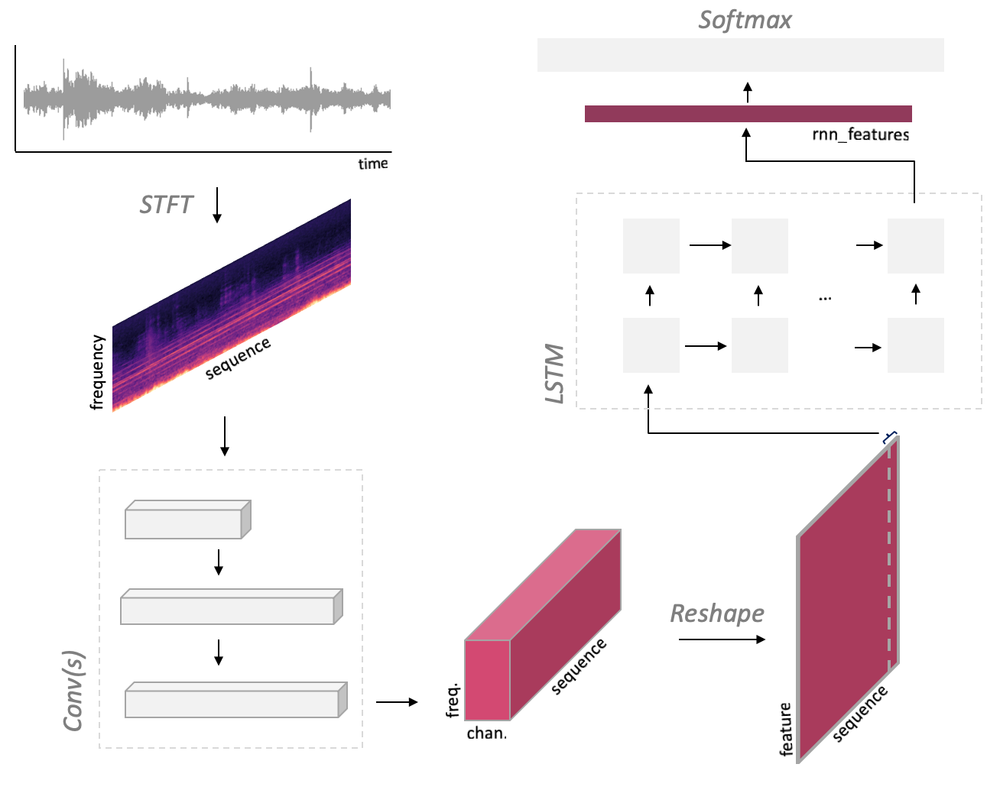
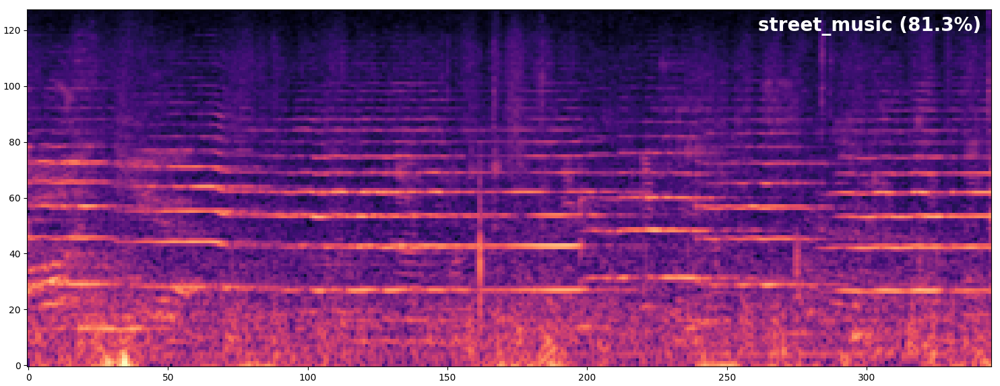
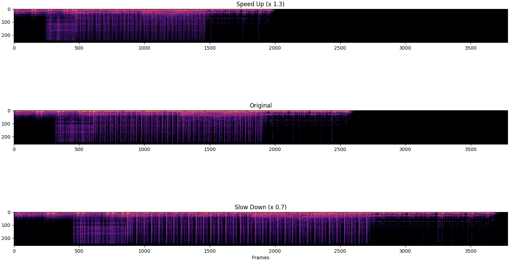
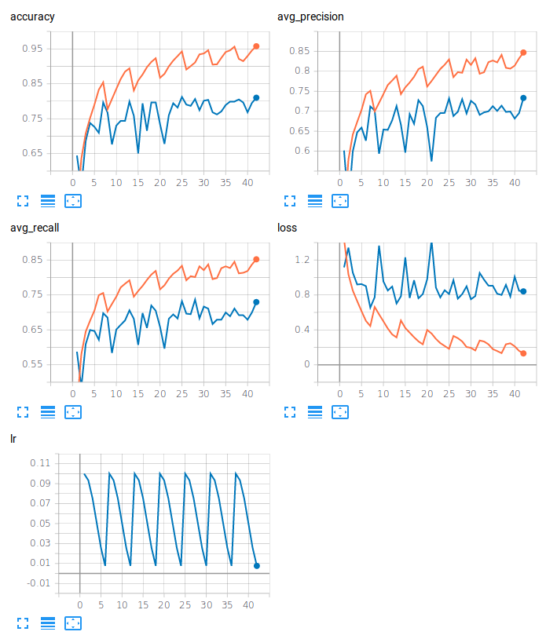

# PyTorch Audio Classification: Urban Sounds


Classification of audio with variable length using a CNN + LSTM architecture on the [UrbanSound8K](https://urbansounddataset.weebly.com/urbansound8k.html) dataset.


Example results:
<p align="center">

</p>


### Contents

- [Models](#models)
- [Inference](#inference)
- [Training](#training)
- [Evaluation](#evaluation)
- [To Do](#to-do)

#### Dependencies

- [soundfile](https://pypi.org/project/SoundFile/): audio loading
- [torchparse](https://github.com/ksanjeevan/torchparse): .cfg easy model definition
- [pytorch/audio](https://github.com/pytorch/audio): Audio transforms 


#### Features
- Easily define CRNN in .cfg format
- Spectrogram computation on GPU
- Audio data augmentation: Cropping, White Noise, Time Stretching (using phase vocoder on GPU!)


### Models

CRNN architecture: 
<p align="center">

</p>

Printing model defined with [torchparse](https://github.com/ksanjeevan/torchparse):

```
AudioCRNN(
  (spec): MelspectrogramStretch(num_bands=128, fft_len=2048, norm=spec_whiten, stretch_param=[0.4, 0.4])
  (net): ModuleDict(
    (convs): Sequential(
      (conv2d_0): Conv2d(1, 32, kernel_size=(3, 3), stride=(1, 1), padding=[0, 0])
      (batchnorm2d_0): BatchNorm2d(32, eps=1e-05, momentum=0.1, affine=True, track_running_stats=True)
      (elu_0): ELU(alpha=1.0)
      (maxpool2d_0): MaxPool2d(kernel_size=3, stride=3, padding=0, dilation=1, ceil_mode=False)
      (dropout_0): Dropout(p=0.1)
      (conv2d_1): Conv2d(32, 64, kernel_size=(3, 3), stride=(1, 1), padding=[0, 0])
      (batchnorm2d_1): BatchNorm2d(64, eps=1e-05, momentum=0.1, affine=True, track_running_stats=True)
      (elu_1): ELU(alpha=1.0)
      (maxpool2d_1): MaxPool2d(kernel_size=4, stride=4, padding=0, dilation=1, ceil_mode=False)
      (dropout_1): Dropout(p=0.1)
      (conv2d_2): Conv2d(64, 64, kernel_size=(3, 3), stride=(1, 1), padding=[0, 0])
      (batchnorm2d_2): BatchNorm2d(64, eps=1e-05, momentum=0.1, affine=True, track_running_stats=True)
      (elu_2): ELU(alpha=1.0)
      (maxpool2d_2): MaxPool2d(kernel_size=4, stride=4, padding=0, dilation=1, ceil_mode=False)
      (dropout_2): Dropout(p=0.1)
    )
    (recur): LSTM(128, 64, num_layers=2)
    (dense): Sequential(
      (dropout_3): Dropout(p=0.3)
      (batchnorm1d_0): BatchNorm1d(64, eps=1e-05, momentum=0.1, affine=True, track_running_stats=True)
      (linear_0): Linear(in_features=64, out_features=10, bias=True)
    )
  )
)
Trainable parameters: 139786
```

### Usage

#### Inference
Run inference on an audio file:

```bash
./run.py /path/to/audio/file.wav -r path/to/saved/model.pth 
```
<p align="left">

</p>


#### Training
```bash
./run.py train -c config.json --cfg arch.cfg
```

##### Augmentation
Dataset transforms:

```bash
Compose(
    ProcessChannels(mode=avg)
    AdditiveNoise(prob=0.3, sig=0.001, dist_type=normal)
    RandomCropLength(prob=0.4, sig=0.25, dist_type=half)
    ToTensorAudio()
)
```
As well as [time stretching](https://github.com/keunwoochoi/torchaudio-contrib/blob/781fe10ee0ee6ccab4628c7e0a56ce8e3add0502/torchaudio_contrib/layers.py#L236):

<p align="left">

</p>


##### TensorboardX
<p align="left">

</p>

#### Evaluation


```bash
./run.py eval -r /path/to/saved/model.pth
```

Then obtain defined metrics:
```bash
100%|█████████████████████████████████████████████████████████████████████████████████████████████████| 34/34 [00:03<00:00, 12.68it/s]
{'avg_precision': '0.725', 'avg_recall': '0.719', 'accuracy': '0.804'}
```

##### 10-Fold Cross Validation

| Arch   |      Accuracy      |  AvgPrecision(macro) | AvgRecall(macro) |
|----------|:-------------:|------:|------:|
| CNN |  71.0% | 63.4% | 63.5% |
| CRNN |  72.3% | 64.3% | 65.0% |
| CRNN(Bidirectional, Dropout) |  73.5% | 65.5% | 65.8% |
| CRNN(Dropout) |  73.0% | 65.5% | 65.7% |
| CRNN(Bidirectional) |  72.8% | 64.3% | 65.2% |

Per fold metrics CRNN(Bidirectional, Dropout):

| Fold   |      Accuracy      |  AvgPrecision(macro) | AvgRecall(macro) |
|----------|:-------------:|------:|------:|
|1|73.1%|65.1%|66.1%|
|2|80.7%|69.2%|68.9%|
|3|62.8%|57.3%|57.5%|
|4|73.6%|65.2%|64.9%|
|5|78.4%|70.3%|71.5%|
|6|73.5%|65.5%|65.9%|
|7|74.6%|67.0%|66.6%|
|8|66.7%|62.3%|61.7%|
|9|71.7%|60.7%|62.7%|
|10|79.9%|72.2%|71.8%|


### To Do
- [ ] commit jupyter notebook dataset exploration
- [x] Switch overt to using pytorch/audio
- [x] use torchaudio-contrib for STFT transforms
- [x] CRNN entirely defined in .cfg
- [x] Some bug in 'infer'
- [x] Run 10-fold Cross Validation
- [x] Switch over to pytorch/audio since the merge 
- [ ] Comment things


